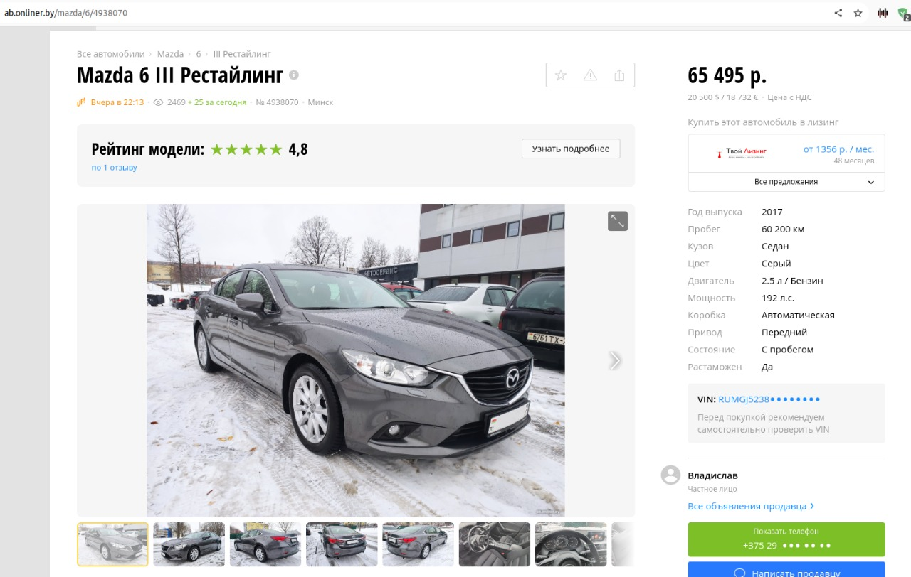
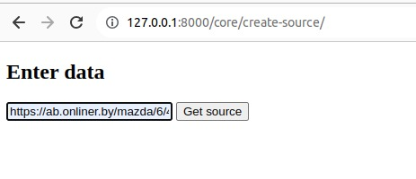
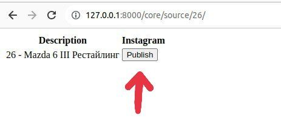
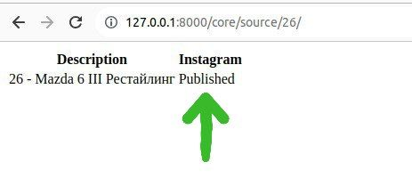
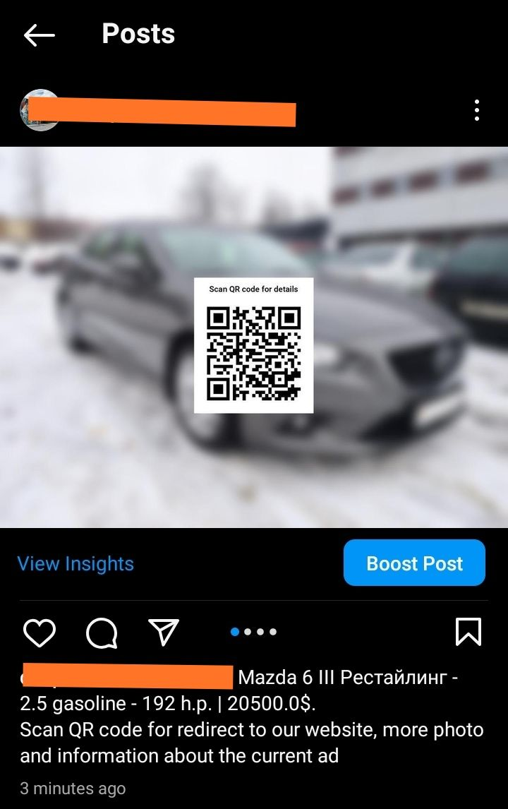

# Social Media Reposter
Marketing prototype application. Reposter from your website to social networks. It includes only main backend functionality without beautiful frontend.


### Instagram Features
* Creation new photo with blur effect and QR code for redirect on your website
* Uploading carousel on your instagram account with caption for post

### Installation

Don't forget create `.env` file with instagram credentials

```docker
docker compose -f docker-compose.yml up --build
```
### Example
`Step 1`



`Step 2`



`Step 3`



`Step 4`



`Result`

